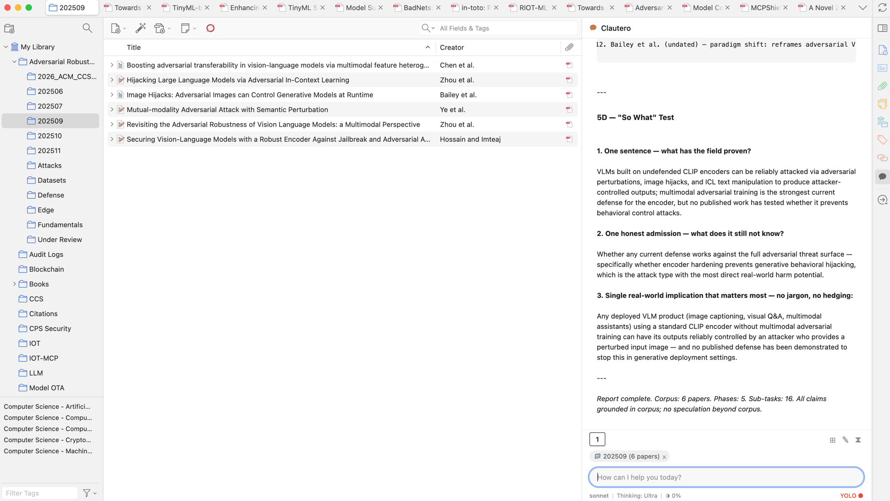
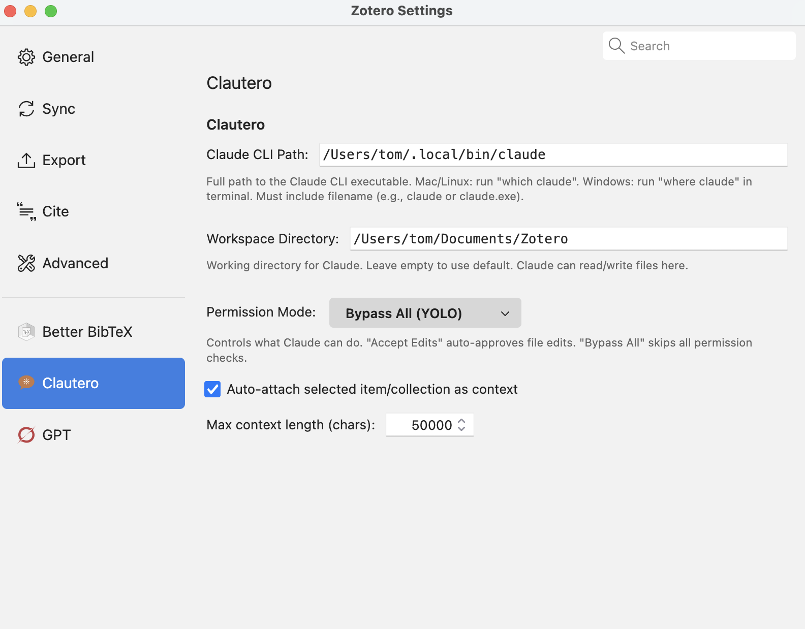
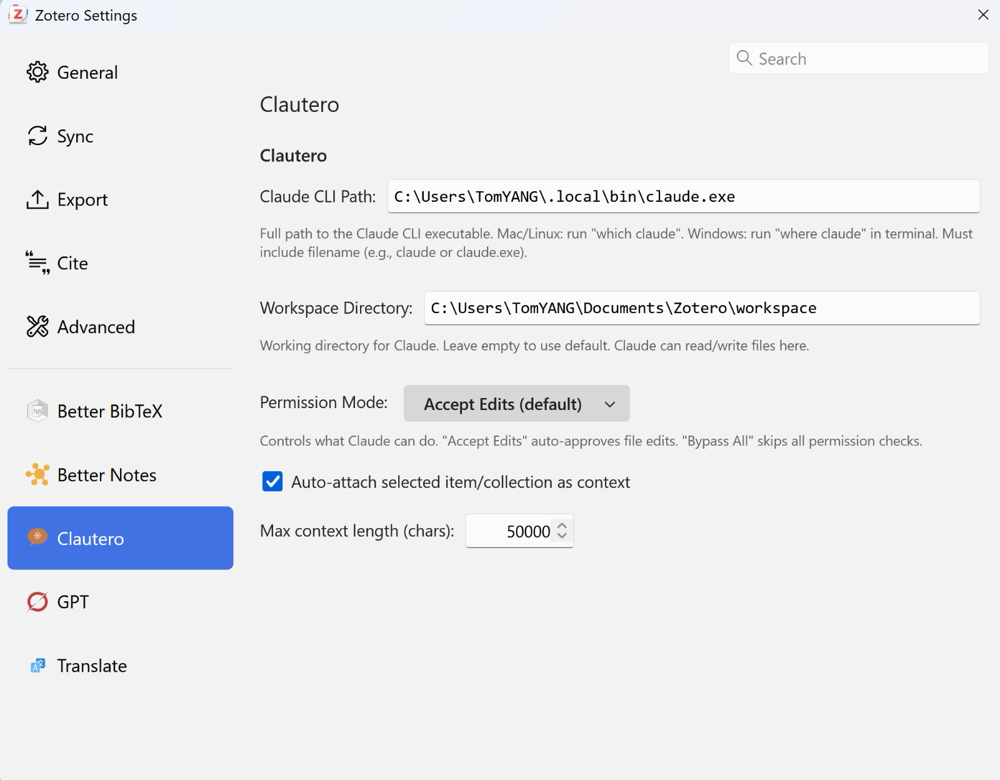

# Clautero

Embed [Claude Code](https://docs.anthropic.com/en/docs/claude-code) into Zotero — like [Claudian](https://github.com/YishenTu/claudian) for Obsidian, but for your research library.




## What is Clautero?

Clautero is **not** a third-party Claude client. It embeds Claude Code — Anthropic's official CLI tool — directly into Zotero's interface. Claude Code handles all the intelligence: API calls, tool use, file access, permissions, and skills. Clautero provides the UI.

```
You (Zotero) → Clautero (UI) → Claude Code CLI (Anthropic) → Claude API
```

## Features

- **Side panel chat** — Claudian-style UI in Zotero's right pane with markdown rendering
- **Paper context** — Select a paper and Claude gets its metadata, abstract, PDF path, and annotations
- **Collection context** — Select a folder and Claude knows about all papers in it
- **Slash commands** — Type `/` to see available commands from both Clautero and Claude Code skills
- **Multi-session tabs** — Up to 5 concurrent chats with numbered tabs `[1] [2] [3]`
- **Session persistence** — Conversations auto-save and restore across Zotero restarts
- **Chat history** — Browse and reload past conversations via the `⧗` button
- **Model selection** — Click to cycle between Sonnet, Opus, Haiku
- **Thinking level** — Click to cycle Low / Medium / High / Ultra (maps to `--effort`)
- **YOLO mode** — Toggle to bypass all permission checks (like Claudian)
- **Context usage** — Shows token usage % after each response
- **Sidenav icon** — always-visible chat bubble in the right sidebar

## Requirements

- **Zotero 7 or 8**
- **Claude Code CLI** — [installed](https://docs.anthropic.com/en/docs/claude-code) and authenticated (`claude login`)

## Installation

1. Download the latest `.xpi` from [Releases](https://github.com/waterwoods-ai/clautero/releases)
2. In Zotero: **Tools → Add-ons → gear icon → Install Add-on From File**
3. Select the `.xpi` file
4. Open **Zotero → Settings → Clautero** and set your Claude CLI path
5. Click the chat bubble icon in the right sidebar

## Settings

Open **Zotero → Settings → Clautero** to configure:

### macOS



### Windows



| Setting | macOS Example | Windows Example |
|---------|--------------|----------------|
| **Claude CLI Path** | `/Users/tom/.local/bin/claude` | `C:\Users\TomYANG\.local\bin\claude.exe` |
| **Workspace Directory** | `/Users/tom/Documents/Zotero` | `C:\Users\TomYANG\Documents\Zotero\workspace` |
| **Permission Mode** | Accept Edits / Plan Mode / Bypass All (YOLO) | Same |
| **Auto-attach Context** | ✅ Enabled | ✅ Enabled |
| **Max Context Length** | 50000 | 50000 |

> **Finding the Claude CLI path:**
> - **macOS/Linux:** Run `which claude` in Terminal
> - **Windows:** Run `where claude` in Command Prompt
>
> **Important:** The path must include the filename (`claude` or `claude.exe`), not just the directory. On Windows, avoid paths with special characters (e.g., OneDrive folders with spaces) — use a simple workspace path like `C:\Users\You\Documents\Zotero\workspace`.

### Status Bar Controls

The status bar at the bottom provides quick toggles:

| Control | Action |
|---------|--------|
| `sonnet` | Click to cycle model: sonnet → opus → haiku |
| `Thinking: Low` | Click to cycle effort: Low → Medium → High → Ultra |
| `◑ 0%` | Context window usage (updates after each response) |
| `YOLO ○` | Click to toggle YOLO mode (● = on, bypasses permissions) |

### Session Controls

| Button | Action |
|--------|--------|
| `[1] [2] [3]` | Session tabs — click to switch, `×` to close |
| `⊞` | New tab (max 5) |
| `✎` | New conversation (saves current to history, clears tab) |
| `⧗` | Browse chat history |

## Build from Source

```bash
git clone https://github.com/waterwoods-ai/clautero.git
cd clautero
npm install
npm run build
# Output: build/clautero-1.1.0.xpi
```

## Usage

### Getting Started

1. Click the **chat bubble icon** (●) in Zotero's right sidebar navigation
2. The Clautero chat panel opens in the item pane area
3. Type a message in the input field and press **Enter** to send
4. Claude Code processes your request and streams the response in real-time

### Working with Papers

- **Select a paper** in your library — its metadata (title, authors, abstract, DOI) and PDF path are automatically attached as context
- **Select a collection/folder** — all papers in the folder become context, so you can ask questions across multiple papers
- The context chip appears above the input field (e.g., `📄 Smith2024.pdf` or `📁 My Collection (6 papers)`)
- Click `×` on a chip to remove the context

### Chat Interface

**Sending messages:**
- Type in the pill-shaped input field at the bottom
- Press **Enter** to send, **Shift+Enter** for a new line
- The input auto-expands as you type (up to 4 lines)

**Streaming responses:**
- *Thought for 3s* — shows in coral italic while Claude thinks, with elapsed time
- **Bold**, *italic*, `code`, and other markdown renders in real-time
- 🔧 `ToolName` ✓ — shows tool usage with a green checkmark when complete
- Code blocks render with syntax highlighting background

### Managing Sessions

- **Session tabs** `[1] [2] [3]` — each tab is an independent conversation with its own Claude instance
- **⊞** — create a new tab (max 5 concurrent sessions)
- **✎** — start a new conversation in the current tab (saves the current chat to history first)
- **⧗** — browse past conversations from chat history
- Sessions **auto-save** after each Claude response and persist across Zotero restarts

### Status Bar

The bottom bar provides quick controls:

- **Click the model name** (e.g., `sonnet`) to cycle: sonnet → opus → haiku
- **Click `Thinking: Low`** to cycle effort level: Low → Medium → High → Ultra
- **◑ N%** shows context window usage after each response
- **Click `YOLO`** to toggle bypass permissions mode (red ● = on)

### Slash Commands

Type `/` in the input to see a dropdown of all available commands:

**Built-in Clautero commands:**
- `/summarize` — summarize the attached paper
- `/explain [topic]` — explain a concept in context
- `/related` — suggest related papers
- `/annotate` — extract annotations by theme
- `/clear` — clear conversation
- `/help` — list commands

**Claude Code skills** are also available — any skill installed in `~/.claude/skills/` appears in the dropdown and is handled natively by Claude Code.

## Architecture

Clautero spawns Claude Code as a subprocess using Gecko's native `Subprocess.jsm`, communicating via the NDJSON streaming protocol.

```
User Input → InputController → ClauteroService → Subprocess.jsm
                                                      ↓
Chat UI ← MessageRenderer ← StreamController ← NDJSONParser ← Claude CLI
                                                      (--model, --effort, --permission-mode)
```

### Project Structure

```
src/
├── index.ts                    # Entry point
├── addon.ts                    # Plugin metadata & directories
├── hooks.ts                    # Lifecycle, sessions, slash commands, status bar
├── core/agent/
│   ├── ClauteroService.ts      # Orchestrates subprocess + parser
│   ├── SubprocessManager.ts    # Gecko Subprocess.jsm wrapper
│   ├── NDJSONParser.ts         # NDJSON stream parser
│   ├── MessageChannel.ts       # Message queue
│   ├── CLIPathResolver.ts      # CLI path from preferences
│   └── types.ts                # TypeScript types
├── modules/
│   ├── sidebar/SidebarManager.ts   # Claudian-style UI + sidenav icon
│   ├── chat/
│   │   ├── ChatState.ts            # Immutable conversation state
│   │   ├── InputController.ts      # Keyboard handling
│   │   ├── MessageRenderer.ts      # Markdown rendering
│   │   └── StreamController.ts     # Chunk routing
│   ├── context/
│   │   ├── ContextBuilder.ts       # Item/collection → XML context
│   │   └── ContextChipsView.ts     # Context chip UI
│   └── commands/
│       └── builtInCommands.ts      # Slash command definitions
addon/
├── bootstrap.js                # Plugin lifecycle
├── manifest.json               # Zotero plugin manifest
├── prefs.js                    # Default preferences
└── content/
    ├── preferences.xhtml       # Settings UI
    └── icons/                  # Plugin icons
```

## License

MIT

## Credits

- Inspired by [Claudian](https://github.com/YishenTu/claudian) (Claude Code for Obsidian)
- Built with [Zotero Plugin Template](https://github.com/windingwind/zotero-plugin-template) patterns
- Powered by [Claude Code](https://docs.anthropic.com/en/docs/claude-code) by Anthropic
